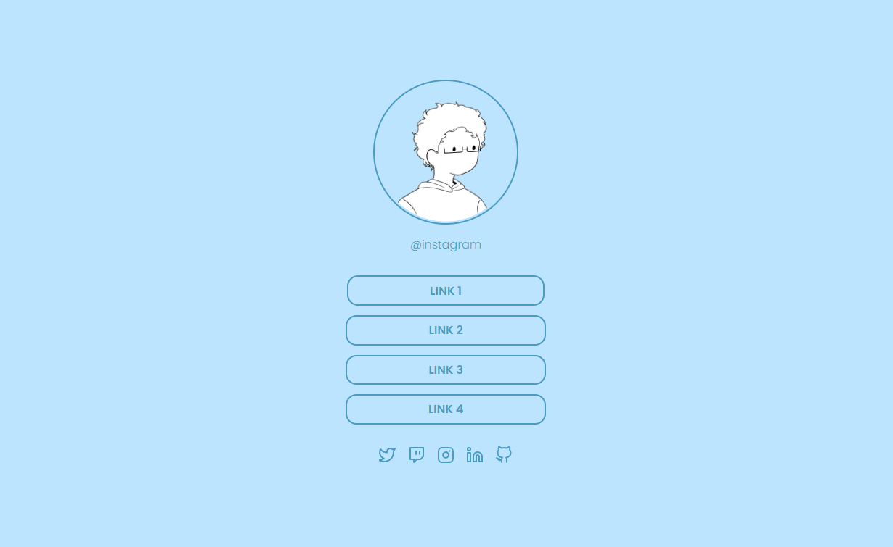

<h1 align="center"> LinkMe </h1>

Site feito do zero com base nos conhecimentos e ideias obtidas no projeto <a href="https://github.com/MatVzn/DevLinks">DevLinks</a>

  <a href="#-tecnologias">Tecnologias</a>&nbsp;&nbsp;&nbsp;|&nbsp;&nbsp;&nbsp;
  <a href="#-projeto">Projeto</a>

  

## 🚀 Tecnologias

Esse projeto foi desenvolvido com as seguintes tecnologias:

- HTML e CSS
- JavaScript
- Git e Github

## 💻 Projeto

O LinkMee é um agregador de links para usar como cartão de visitas online. O grande diferencial dele para o DevLinks é a possibilidade de ver a página em várias cores diferentes, tendo como objetivo reforçar o conhecimento no uso de variáveis no CSS.

- [Acesse o projeto finalizado, online](https://matvzn.github.io/LinkMee/)
 

---
Feito por Matteo